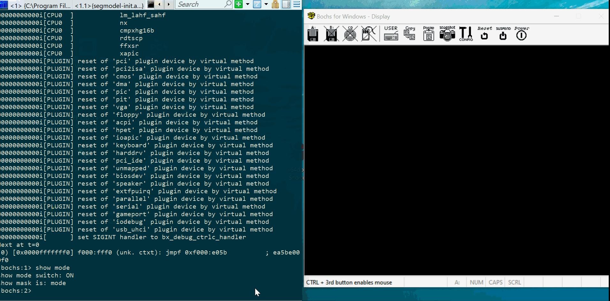

#### Motivation
Learning CPU 'protected mode'. Manually initialize global table
descriptors, GDTR registers, CR0 register and execute some code
from previously initialized memory segments.

#### Description
1. Craft two memory descriptors: first descriptor's linear memory starts
somewhere in between _0x7C00:0x7E00_ (Master Boot Record). Second 
descriptor's linear address starts from _0xB8000_ (Video Memory)
2. Initialize GDTR register
3. Switch 0th bit of CR0 to 1 (enable protected mode)
4. Jump to code of selector _8_ (descriptor one)  - copy bytes into 
second descriptor's memory
5. Observe text on display

#### Demo

